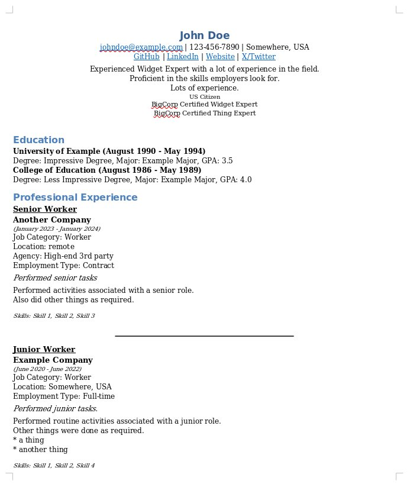

# Resume Writer

This is a simple resume writer that takes a text file and converts into a Word document. The current output is very plain, making it more likely to be successfully parsed by Automatic Tracking Systems (ATS).

This helps applicants to quickly adapt resumes to different job applications. When copying from LLM output, authors don't have to worry about messing up the doc formatting.

For recruiters receving generated applications, it's easier for them to add and update resumes to their ATS.

## Motivation

I've recently been looking for a job, and this particular market is pretty tough. That means applying a _lot_.

A common problem are web forms that require a resume to be uploaded to be parsed. Most of the time, the parsing fails miserably. 

# Using the app

## Sample input

The test file is the best way to see how the input should be formatted. It's in the source code [here](https://raw.githubusercontent.com/mpaguilar/resume_writer/main/tests/test_resume.md)

Details about section types and each section can be found [here](./docs/format_details.md)

## Sample output

The output is very plain. If you're looking for an impressive resume with lots of tables, this isn't it. Things like tables, bullet points, icons, and colors are difficult for ATS to parse. 

Here's a screenshot:


The heading is cluttered. It is suggested that only important fields be included. That can be controlled with the settings file.

## Controlling the output

Almost everything can be controlled by a settings file. By default, everything is output. This isn't recommended. It results in a rather cluttered resume, especially the headings like "work authorization", "banner", "note", etc.

## Settings file

The settings file is a TOML file. Entries are completely optional. [These settings result in cleaner output](https://github.com/mpaguilar/resume_writer/blob/docs/resume_writer/resume_settings.toml). [This is a full list of available settings](https://github.com/mpaguilar/resume_writer/blob/docs/resume_writer/debug_settings.toml). The names of the sections correspond with the headings in the input file.

## Creating a new resume

The input file is _data_, not a document. Even though it is text, it is structured. Heading indentation must be respected, and the heading names must be correct. No formatting should be added, any text will be added to the document as-is. For example, adding `*bold*` to the text will add "*bold*" to the document. The text will not be bolded. This is true of tables, extra tabs, etc.

> [!NOTE]
> Date format is very picky, and must be in the format `MM/YYYY`. Improving date parsing is a very high priority. 

## Running the app

This is a command-line app. A web-interface is beyond the current scope of the project, even though I'd really like to add one.

### Installation

This is written and tested with Python 3.10. It uses [Poetry](https://python-poetry.org/) for dependency management. If you have that installed, you can install the dependencies with `poetry install` from the root directory. There is a `requirements.txt` file for those who don't want to use Poetry.

### Running the app

Change to the `resume_writer` directory and run `python main.py --help` to see the options.

```
Usage: main.py [OPTIONS] INPUT_FILE

  Convert a text resume to a .docx file.

Options:
  --output-file PATH
  --settings-file PATH
  --help                Show this message and exit.
```

For example:

```
python main.py ./tests/test_resume.md --output-file test_resume.docx --settings-file resume_settings.toml
```

## Creating a new style of document

`resume_render/basic` has a full test suite. To create a new style of resume:
- copy the `basic` folder
- rename the file prefix from `basic_` to `<your_style>_`
- update the imports in `resume_render/<your_style>/<your_style>_resume.py`
- hack away

## Making changes to `resume_render/basic`
The basic renderer has a full test suite. If any logic changes are required, update the tests.


## License
This project is licensed under the Creative Commons Attribution-NonCommercial 4.0 International License. See the LICENSE file for details.
