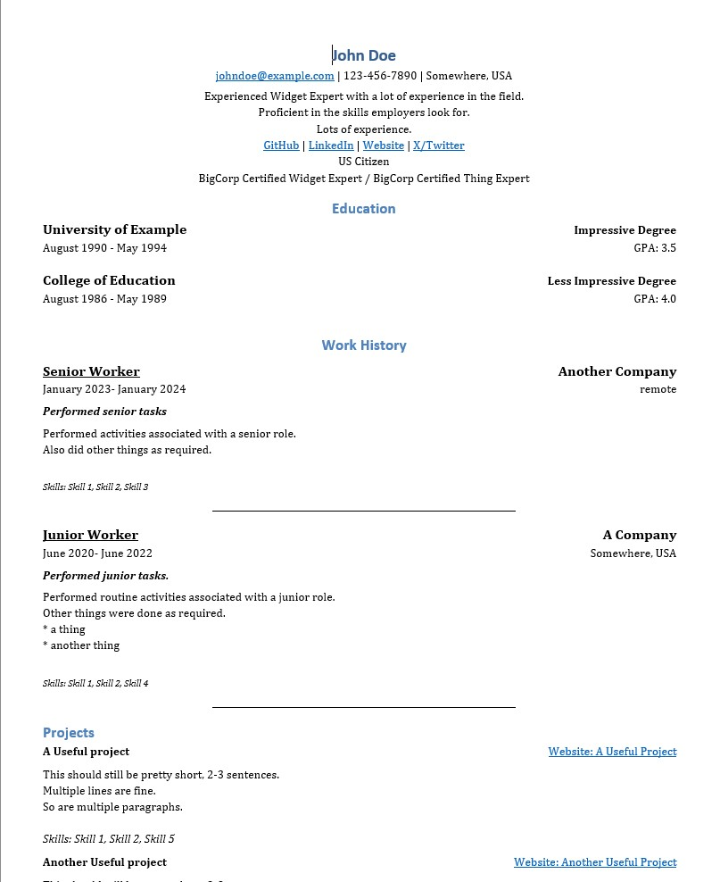
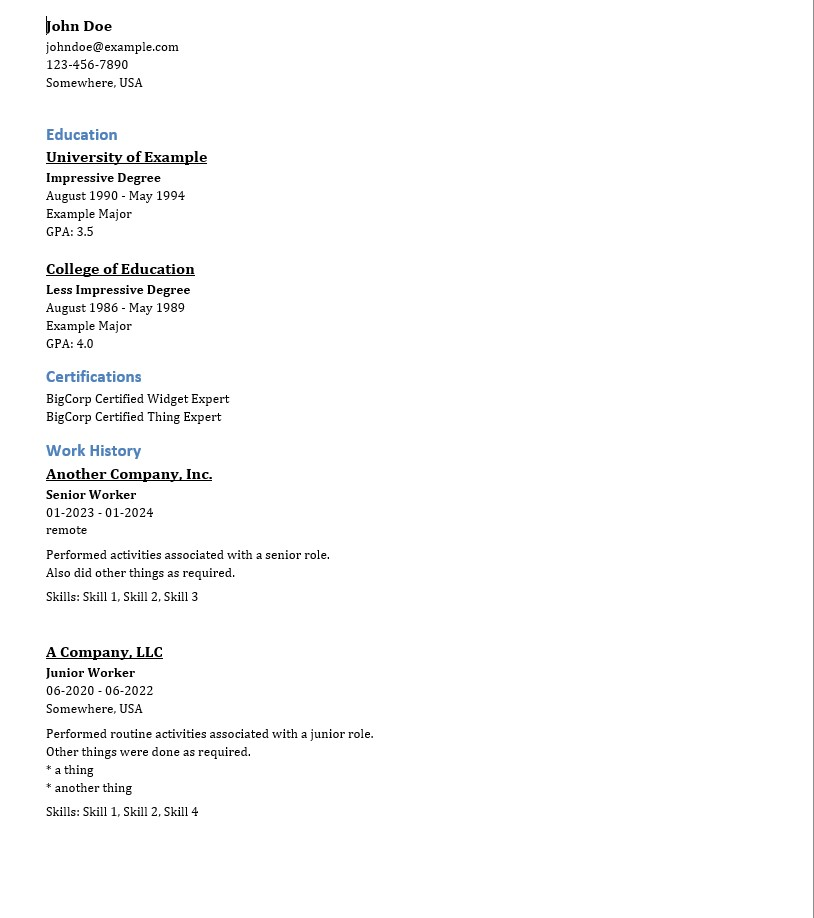

# Resume Writer

This is a simple resume writer that takes a text file and converts into a Word document in one of three formats.

- The "plain" format is better for human readers. It isn't fancy, but it is easy to read and understand. Engineering managers seem to prefer it. If you're applying for a more sophisticated job (CxO, Graphic Designer, FAANG), this is _not_ the resume you'll want to use. It's a good starting point for those.

- The "plain" format also has optional "Executive Summary" and "Skills Matrix" sections. They are enabled by default, and are very useful if you're having trouble fitting everything into one or two pages, for example, you have a long job history. It can be used as part of a cover letter, as well.

- The "ats" format is similar to the basic format, but is well-suited for ATS. There are no columns, tables, or bullet points, as these are all things that can trip up ATS parsing.

- The "basic" format is meant for testing and debugging. Neither humans nor machines will really like it.

## Motivation

A common problem for applicants are web forms that require a resume to be uploaded for parsing. Many times, the parsing fails miserably. This leads to the candidate filling in a bunch of little text boxes. This is tedious and time-consuming, especially when the candidate is applying for muliple positions.

AI isn't really much of solution, yet. Details about that can be found [here](./docs/AI_Resume_Parsing.md). I'm sure that someone will eventually figure it out, but it will be awhile before it percolates through the hiring ecosystem. Changing or upgrading an ATS isn't as easy as it sounds.

At the same time, recruiters will ask candidates for something more interesting or easier to read. They may ask for certain details to be changed, added, or removed. For short simple resumes, this isn't a big deal, but as a resume becomes more complex

The preferred usage with this app is to generate two resumes: one in the "plain" format and another in the "ats". Most, if not all, online applications will ask you if you want to upload any additional files, or even give an opportunity to replace the resume you already uploaded.

# Using the app

## Basic usage

This app is a command line app. If time allows a web front-end will be developed, but that greatly exceeds the current scope.

## Sample input

The test file is the best way to see how the input should be formatted. It's in the source code [here](https://raw.githubusercontent.com/mpaguilar/resume_writer/main/tests/test_resume.md)

Details about section types and each section can be found [here](./docs/format_details.md)

The parser is rather unforgiving at the moment. The error messages are pretty good, but it means understanding enough about both Python and the format to understand the problem. Updating this deficiency is a priority.

## Sample output

### Plain format

As the name suggests the output is very plain. It is loosely based on the template suggested in the [EngineeringResumes](https://www.reddit.com/r/EngineeringResumes/) subreddit. It can be viewed [here](https://imgur.com/TraV3Qn).

If the heading has fields you aren't interested in including, they can be disabled in the settings file `settings_nosummary_resume.toml`.

#### Screenshot

This is the recommended format for recruiters, hiring managers, and other humans.

The headline/personal section is a little cluttered in this example. It's suggested that only important fields should be included in the headline section. You can adjust these in the settings file `settings_nosummary_resume.toml`.



### ATS format

This is the recommended format for webforms which attempt to parse and automatically fill out a candidate's work history. It works well with most ATS systems, but not 100% of them. Workday, one of the most prevalent ATS systems, works well with this format.

> [!NOTE] 
> Include "LLC", "Corp." or some other suffix to company names for best results.

#### Screenshot


## Creating your resume, the text file

The input file is _data_, not a document. Even though it is text, it is structured. Heading indentation must be respected, and the heading names must be correct. No formatting should be added, any text will be added to the document as-is. For example, adding `*bold*` to the text will add "*bold*" to the document. The text will not be bolded. This is true of tables, extra tabs, etc.

It does use markdown-style headings, but it is not markdown. The heading format was chosen because many text editors have facilities to collapse them.

## Controlling the output

Almost everything can be controlled by a settings file. By default, everything is output. This isn't recommended. It results in a rather cluttered resume, especially the headings like "work authorization", "banner", "note", etc.

### Settings file

The settings file is a TOML file. Entries are completely optional. [This is a full list of available settings](https://github.com/mpaguilar/resume_writer/blob/docs/resume_writer/debug_settings.toml). The names of the sections correspond with the headings in the input file.

### Sample settings files

- [No summary](https://raw.githubusercontent.com/mpaguilar/resume_writer/main/resume_writer/settings_nosummary_resume.toml). Omits the "summary" section, including only roles and projects.
- [Executive summary](https://raw.githubusercontent.com/mpaguilar/resume_writer/main/resume_writer/resume_writer/settings_summary_resume.toml). Includes the Executive Summary and Skills Matrix sections, only.
- [ATS](https://raw.githubusercontent.com/mpaguilar/resume_writer/main/resume_writer/settings_ats_resume.toml). Used for ATS-friendly parsing.

## Running the app

This is a command-line app. A web-interface is beyond the current scope of the project, even though I'd really like to add one.

### Installation

This is written and tested with Python 3.10. It uses [Poetry](https://python-poetry.org/) for dependency management. If you have that installed, you can install the dependencies with `poetry install` from the root directory. There is a `requirements.txt` file for those who don't want to use Poetry.

### Running the app

Change to the `resume_writer` directory and run `python main.py --help` to see the options.

```
Usage: main.py [OPTIONS] INPUT_FILE

  Convert a text resume to a .docx file.

Options:
  --output-file PATH
  --settings-file PATH
  --resume-type [ats|basic|plain]
  --help                          Show this message and exit.
```

For example:

```
python main.py ./tests/test_resume.md --output-file test_resume.docx --settings-file resume_settings.toml
```

## Creating a new style of document

`resume_render/basic` has a full test suite. To create a new style of resume:
- copy the `basic` folder
- update `main.py`
- update the imports in `resume_render/<your_style>/resume_main.py`
- hack away

## Making changes to `resume_render/basic`
The basic renderer has a full test suite. If any logic changes are required, update the tests.


## License
This project is licensed under the Creative Commons Attribution-NonCommercial 4.0 International License. See the LICENSE file for details.
